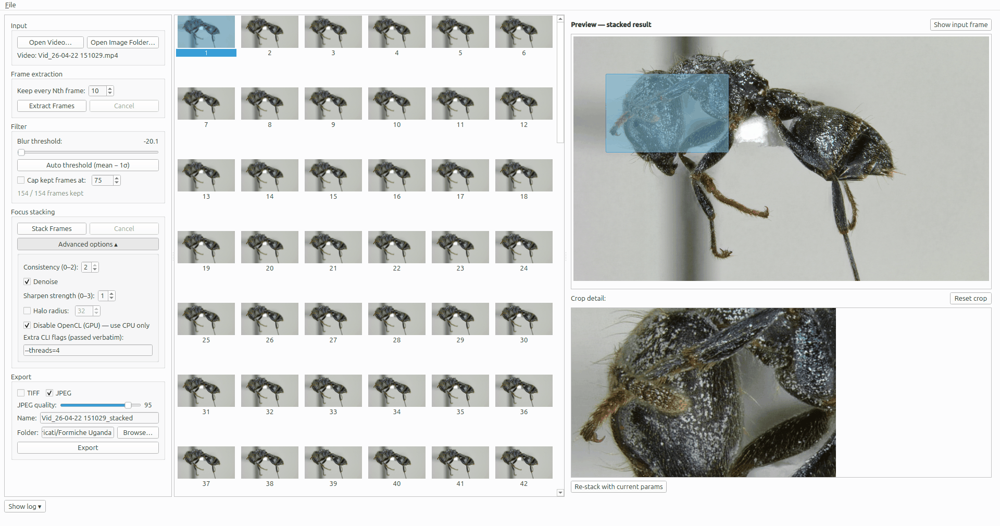

# StackAnt

[](https://github.com/Camponotus-vagus/StackAnt/actions/workflows/ci.yml)
[](LICENSE)

A focus-stacking GUI for macro entomology photography.

Record a short video of a specimen while rotating the lens's focus ring
through the depth of the subject, drop it into StackAnt, and get back a
single publication-ready composite in which the whole specimen is in
focus — all without manually picking and stacking frames.

<p align="center">
  
</p>

<p align="center"><em>Pictured: a Ugandan ant specimen, stacked from a single manual-focus-pull video.</em></p>

## Features

- Load a video (MP4/MOV/AVI/MKV) **or** an existing folder of images.
- Extract frames through `ffmpeg` with optional decimation.
- Automatic blur detection (Laplacian variance) flags unusable transition
  frames; a slider tunes the threshold live.
- Even-spaced decimation caps the set at a target frame count (~75 by
  default) before stacking.
- Stack via [`focus-stack`](https://github.com/PetteriAimonen/focus-stack)
  with defaults that work out of the box and an Advanced panel for the
  rest.
- Preview the result at a scaled size, draw a rectangle to inspect any
  region at 1:1, and toggle between the stacked output and a selected
  input frame for comparison.
- Export to TIFF (lossless) and/or JPEG (quality 60–100).
- Keyboard shortcuts, persistent settings, cancellable subprocesses.

## Why StackAnt?

Two things StackAnt does that Helicon Focus and Zerene Stacker don't:

- **Video-first.** A manual-focus-pull video is often the fastest way
  to capture a specimen — in the field, or at a microscope whose stock
  software doesn't ship with focus-stacking (or where it's a paid
  add-on). StackAnt takes the video directly and extracts frames for
  you. Commercial stackers expect you to arrive with *N*
  already-separated image files.
- **Automatic frame-quality filtering.** Transition frames where the
  lens is still sliding are motion-blurred and useless. StackAnt
  scores each frame's Laplacian variance on ingest and rejects the
  bottom tail automatically, with a live slider for override. Other
  stackers require manual pre-culling.

It's also free and open-source (MIT), and the log panel records every
subprocess command so any run is reproducible.

## Requirements

- **Python 3.10 or newer** (tested on 3.12).
- **[ffmpeg](https://ffmpeg.org/)** on your PATH.
- **[focus-stack](https://github.com/PetteriAimonen/focus-stack)** on
  your PATH (Petteri Aimonen's CLI — not any other "focus-stack" tool).
- Linux (primary) or Windows.

StackAnt shows a blocking dialog at launch if either tool is missing,
with exact install instructions for your platform.

## Install

### 1. System dependencies

**Debian / Ubuntu / Linux Mint**

```bash
sudo apt install ffmpeg libopencv-dev libxcb-cursor0 build-essential git
git clone https://github.com/PetteriAimonen/focus-stack.git
cd focus-stack && make
# Install to either a system path (needs sudo):
sudo cp build/focus-stack /usr/local/bin/
# …or to your user-local bin (no sudo, assumes ~/.local/bin is on PATH):
mkdir -p ~/.local/bin && cp build/focus-stack ~/.local/bin/
```

`libxcb-cursor0` is required by PyQt6 ≥ 6.5 on X11. Without it the app
aborts at launch with "no Qt platform plugin could be initialized".

**Note on OpenCL:** on some machines `focus-stack` fails mid-run with a
`CL_OUT_OF_RESOURCES` error from the GPU driver. If that happens, open
the **Advanced** panel and check **Disable OpenCL (GPU)** — stacking
falls back to CPU-only processing (slower but reliable).

**Windows**

- `ffmpeg`: download a static build from
  <https://www.gyan.dev/ffmpeg/builds/> and add its `bin/` folder to
  `PATH`.
- `focus-stack`: grab a release binary from
  <https://github.com/PetteriAimonen/focus-stack/releases> and put it in
  a folder on `PATH`.

### 2. StackAnt

```bash
git clone <this-repo-url> stackant
cd stackant
python3 -m venv .venv
source .venv/bin/activate        # Windows: .venv\Scripts\activate
pip install -r requirements.txt
python main.py
```

## Usage

1. **Open a video** (or an image folder) from the File menu or the
   Controls panel.
2. Pick a decimation factor if the video is long (e.g. `3` keeps every
   third frame), then click **Extract Frames**.
3. StackAnt scores each frame, auto-picks a blur threshold, and flags
   unusable frames in red. Nudge the slider or double-click (or press
   **Space**) any frame to override.
4. Click **Stack Frames**. `focus-stack` runs in the background and its
   output streams to the collapsible log panel.
5. The composite appears in the preview pane. Drag a rectangle to see a
   1:1 detail. Toggle between the stacked result and any input frame
   with the button above the preview.
6. **Export** to TIFF and/or JPEG with a single click. Output folder
   opens automatically on success.

## Development

```bash
pip install -r requirements-dev.txt
pytest                # 29 unit tests
ruff check stackant
```

The codebase is split cleanly between pure-logic modules (frame_filter,
stacker, exporter, frame_extractor command building) and Qt UI widgets,
so most logic has non-Qt tests.

## Roadmap

- **v0.2 — Laplacian-pyramid fusion:** a pure-Python stacking method
  alongside `focus-stack`, targeting cleaner edges on hard contrast
  boundaries (legs, antennae against sky). Same algorithm family
  commercial tools (Helicon "Method C", Zerene "PMax") use.
- **v0.3 — Batch processing:** queue multiple videos, dial in settings
  once, run the full pipeline on each in sequence.
- **v0.4 — Polish:** optional input downscaling for
  memory-constrained integrated GPUs, reproducibility manifest on
  export, Windows end-to-end validation.
- **v0.5 — Bundled installers** so end users don't need a Python
  toolchain.
- **v1.0 — Stable release** once everything above is shipped and
  verified without caveats.

See `CHANGELOG.md` for details.

## Contributing

Bug reports and pull requests welcome. Please include the contents of
the log panel (use the **Copy log** button) when reporting a problem.

## License

MIT — see `LICENSE`.
